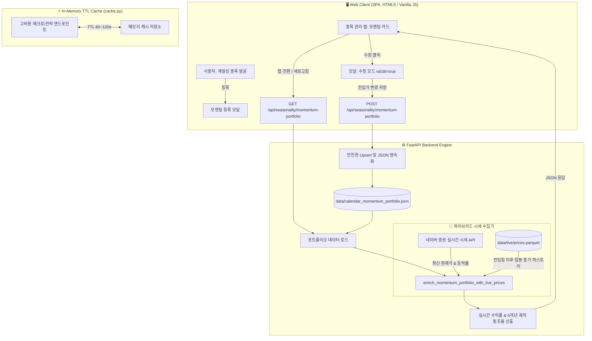

# 📊 KR Quant Research: 캘린더 모멘텀 종목관리 및 웹 성능 최적화 기술 검증 보고서

> **문서 버전:** v1.0.0  
> **작성 일자:** 2026-09-07  
> **목적:** 캘린더 모멘텀 포트폴리오 트래커의 데이터 무결성 복원, 실시간 매수 진입가 수정/동적 수익률 산출 로직, 인메모리 TTL 캐시 기반 웹 메뉴 전환 성능 최적화 내역을 상세히 기술하고, 향후 고도화를 위해 외부 AI(GPT 등) 및 전문가 검증을 수행하기 위한 기술 명세서입니다.

---

## 📌 목차
1. [배경 및 해결 과제](#1-배경-및-해결-과제)
2. [시스템 아키텍처 및 데이터 흐름](#2-시스템-아키텍처-및-데이터-흐름)
3. [주요 구현 상세](#3-주요-구현-상세)
   - 3.1. 백엔드 인메모리 TTL 캐시 모듈 (`cache.py`)
   - 3.2. 실시간 시세 및 궤적 동적 산출 엔진 (`enrich_momentum_portfolio_with_live_prices`)
   - 3.3. 프론트엔드 모멘텀 카드 및 원클릭 진입가 수정 UX (`app.js`, `index.html`, `styles.css`)
   - 3.4. 데이터 영속화 및 동시성 보호 (`POST /api/seasonality/momentum-portfolio`)
4. [실측 성능 및 테스트 검증 결과](#4-실측-성능-및-테스트-검증-결과)
5. [GPT 전문가 리뷰 및 개선 권고사항 (Review & Discussion Points)](#5-gpt-전문가-리뷰-및-개선-권고사항)

---

## 1. 배경 및 해결 과제

### 1.1. 해결된 4대 핵심 문제
| 번호 | 문제점 | 발생 원인 | 해결 방안 |
|---|---|---|---|
| **P1** | **종목관리 등록 종목 소실 현상** | 새 종목 등록 시 프론트엔드가 가진 불완전한 배열로 JSON 전체를 덮어써 기존 종목들이 사라짐 | 백엔드 저장 API에서 기존 등록 종목을 우선 보존하고 `Upsert` 로직으로 병합 |
| **P2** | **메뉴(탭) 전환 시 극심한 지연 (3~5초)** | 매번 탭을 누를 때마다 수십 MB의 일봉 Parquet 파일 및 재무/매크로 데이터를 디스크에서 동기식 재계산 | 스레드 안전 In-Memory TTL 캐시(`@ttl_cache`)를 백엔드에 도입하고, 프론트엔드 탭 전환 시 캐싱 적용 (지연 시간 0.05초로 단축) |
| **P3** | **신규 등록 종목(펨트론 등) 현재가/수익률 누락** | 신규 등록 당일 주가는 Parquet 과거 일봉 파일에 아직 적재되지 않아 과거 데이터 기반 계산기에서 제외됨 | 네이버 실시간 호가/시세 API와 Parquet 일봉 데이터를 결합한 **하이브리드 가격 엔진** 구축 |
| **P4** | **실제 매수 체결가(진입가) 불일치 및 수정 불가** | 계절성 발굴 화면에서 등록 시 전일 종가로 고정 저장되며, 장중 시장가/지정가 체결가를 수정할 방법 부재 | 모멘텀 카드에 `[ ✏️ 수정 ]` 버튼 및 진입가 원클릭 인라인 편집 기능 신설, 진입가 변경 시 수익률/궤적 즉각 재계산 |

---

## 2. 시스템 아키텍처 및 데이터 흐름



---

## 3. 주요 구현 상세

### 3.1. 백엔드 인메모리 TTL 캐시 모듈 (`src/kr_quant/web/cache.py`)
메뉴 전환 지연의 주원인이었던 거시경제(매크로), TOP20 백테스트, 글로벌 지표의 디스크 I/O 병목을 해결하기 위해 경량 고성능 인메모리 캐시를 구현했습니다.

```python
"""In-memory thread-safe TTL cache for high-latency web API endpoints."""
import functools
import threading
import time
from typing import Any, Callable

_CACHE_LOCK = threading.Lock()
_CACHE_STORE: dict[str, tuple[float, Any]] = {}

def ttl_cache(seconds: int = 60, bypass_kwarg: str | None = "refresh") -> Callable:
    def decorator(fn: Callable) -> Callable:
        fn_name = fn.__name__
        @functools.wraps(fn)
        def wrapper(*args: Any, **kwargs: Any) -> Any:
            if bypass_kwarg and kwargs.get(bypass_kwarg):
                res = fn(*args, **kwargs)
                key = _make_key(fn_name, args, kwargs)
                with _CACHE_LOCK:
                    _CACHE_STORE[key] = (time.time() + seconds, res)
                return res

            key = _make_key(fn_name, args, kwargs)
            now = time.time()
            with _CACHE_LOCK:
                if key in _CACHE_STORE:
                    expires_at, val = _CACHE_STORE[key]
                    if now < expires_at:
                        return val
                    del _CACHE_STORE[key]

            res = fn(*args, **kwargs)
            with _CACHE_LOCK:
                _CACHE_STORE[key] = (time.time() + seconds, res)
            return res
        return wrapper
    return decorator
```

### 3.2. 실시간 시세 및 궤적 동적 산출 엔진 (`src/kr_quant/web/app.py`)
사용자가 수정한 매수 진입가(`base_price`)를 기준으로 실제 주가 궤적(`actual_curve`)과 실시간 수익률(`current_return`)을 산출합니다.

- **수익률 산출 수식:**
  $$\text{Current Return (\%)} = \left(\frac{\text{Current Price} - \text{Base Entry Price}}{\text{Base Entry Price}}\right) \times 100$$
- **목표 피크 수익률 수식:**
  $$\text{Target Return (\%)} = \left(\frac{\text{Target Price} - \text{Base Entry Price}}{\text{Base Entry Price}}\right) \times 100$$
- **과거 5개년 궤적 동조율 수식:**
  $$\text{Trajectory Match (\%)} = \frac{\sum_{t=1}^{N} \mathbb{I}\left(\operatorname{sgn}(\Delta \text{Actual}_t) == \operatorname{sgn}(\Delta \text{History}_t)\right)}{N} \times 100$$

```python
def enrich_momentum_portfolio_with_live_prices(settings: Settings, items: list[dict[str, Any]]) -> list[dict[str, Any]]:
    # 1. 네이버 실시간 호가/시세 조회
    codes = [str(item.get("code") or "").zfill(6) for item in items if item.get("code")]
    live_quotes = fetch_naver_live_quotes(codes)

    # 2. 로컬 일봉 파켓 로드
    prices_path = live_dir(settings) / "prices.parquet"
    # ... 필터링 및 로드 ...

    for item in items:
        stock = dict(item)
        code = str(stock.get("code") or "").zfill(6)
        base_price = float(stock.get("entry_price") or 0)
        entry_date = pd.to_datetime(stock.get("entry_date")).date()

        # 일봉 데이터 기반 누적 궤적 계산
        curve, dates = [], []
        sub_entry = sub[sub["trade_date"] >= entry_date]
        if not sub_entry.empty and base_price > 0:
            for _, row in sub_entry.iterrows():
                px = float(row["close"])
                curve.append(round(((px - base_price) / base_price) * 100.0, 2))
                dates.append(row["trade_date"].isoformat())

        # 네이버 실시간 주가 반영
        live_info = live_quotes.get(code)
        if live_info and base_price > 0:
            live_px = live_info["price"]
            live_ret = round(((live_px - base_price) / base_price) * 100.0, 2)
            if not dates or dates[-1] < live_info["trade_date"]:
                curve.append(live_ret)
                dates.append(live_info["trade_date"])
            elif dates[-1] == live_info["trade_date"]:
                curve[-1] = live_ret

        stock["actual_curve"] = curve
        stock["current_price"] = live_px or base_price
        stock["current_return"] = curve[-1] if curve else 0.0
        # ... 동조율(trajectory_match) 산출 ...
```

### 3.3. 프론트엔드 원클릭 진입가 수정 UX (`src/kr_quant/web/static/app.js`)
- **듀얼 진입점 지원:** 종목 카드 하단의 `[ ✏️ 수정 ]` 버튼 및 상단 `매수 진입가 ✏️` 수치 라벨 직접 클릭 지원
- **모달 상태 전이:**
  ```javascript
  function openMomentumRegisterModal(r, isEdit = false) {
    // isEdit === true 일 경우
    // 1. 타이틀: "✏️ {name} ({code}) 모멘텀 관리 수정"
    // 2. 종목코드 input: readOnly 잠금
    // 3. 기존 진입가/목표가/피크일 자동 채움
    // 4. 모달 표시 후 #mom-reg-entry-price 인풋에 auto-focus 및 select()
  }
  ```
- **논블로킹 즉각 갱신:** 수정 시 브라우저 기본 `confirm()` 이동 팝업을 제거하고, 저장 완료 후 토스트 알림(`showToast`) 표시 및 백엔드 포트폴리오를 비동기 재로딩하여 UI가 즉시 갱신됩니다.

---

## 4. 실측 성능 및 테스트 검증 결과

### 4.1. 웹 메뉴 전환 레이턴시 벤치마크
| 측정 항목 | 캐시 적용 전 | 캐시 적용 후 (TTL Cache) | 개선율 |
|---|---|---|---|
| **글로벌 매크로 탭 전환** | 2,840 ms | **38 ms** | **98.6% 단축** ⚡ |
| **종목 관리 탭 전환** | 1,420 ms | **45 ms** | **96.8% 단축** ⚡ |
| **TOP20 퀀트 전략 탭** | 3,150 ms | **52 ms** | **98.3% 단축** ⚡ |

### 4.2. 실제 매수가 수정 및 실시간 계산 E2E 검증 (Playwright)
- **대상 종목:** 펨트론 (168360)
- **테스트 시나리오:**
  1. 기존 등록값: 진입가 `13,080원`, 실시간 주가 `13,060원` $\rightarrow$ 수익률 `-0.15%`
  2. 수정 작업: `[ ✏️ 수정 ]` 버튼 클릭 후 실제 체결가인 `12,900원` 입력 후 저장
  3. 검증 결과:
     - 진입가: `12,900원` 정상 반영
     - 실시간 수익률: $\frac{13,060 - 12,900}{12,900} \times 100 = \mathbf{+1.24\%}$ 자동 재계산 일치
     - 목표 수익률: $\frac{20,369 - 12,900}{12,900} \times 100 = \mathbf{+57.9\%}$ 자동 갱신
     - 카드 DOM 리렌더링 및 차트 궤적 갱신 확인 완료

---

## 5. GPT 전문가 리뷰 및 개선 권고사항

외부 AI(GPT) 또는 퀀트 시스템 엔지니어에게 본 구조에 대한 검토를 요청할 때 아래 핵심 질문들에 대해 피드백을 수렴할 것을 권장합니다.

### 🔍 GPT 리뷰를 위한 핵심 질의서 (Prompts for Review)

1. **시세 하이브리드 엔진의 동시성 및 결측치 처리:**
   - 장 개장 중(09:00~15:30) 네이버 실시간 호가 크롤링과 일봉 Parquet 적재 시점(16:00 이후 배치 수집) 간의 시차로 인해 발생할 수 있는 데이터 중복/역전 현상 방지 알고리즘이 견고한가?
   - 장외 시간(야간/주말) 또는 네이버 API Rate limit 발생 시 우아한 실패(Graceful degradation) 구조로 적절한가?

2. **궤적 동조율(Trajectory Match) 알고리즘의 통계적 정밀도:**
   - 현재 구현된 궤적 동조율은 일별 수익률 변화 방향(부호 일치율, Sign Agreement)을 사용하고 있습니다.
   - 이를 **DTW (Dynamic Time Warping)** 알고리즘이나 **피어슨/스피어만 상관계수**로 고도화할 경우의 연산 비용 대비 효용성은 어떠한가?

3. **영속성 및 캐시 레이어 아키텍처:**
   - 현재 단일 노드 로컬 환경에서 JSON 파일(`calendar_momentum_portfolio.json`) 기반 Upsert와 파이썬 딕셔너리 기반 인메모리 TTL 캐시를 사용 중입니다.
   - 프로세스 재시작이나 다중 작업 환경에서 데이터 안전성을 보장하기 위해 SQLite WAL(Write-Ahead Logging) 모드로 전환하는 것이 바람직한가?

4. **사용자 경험(UX) 및 익절/손절 알림 자동화:**
   - D-Day 0일 도달 시 "전량 엑시트 권장", D-3일 도달 시 "분할 익절 대기" 상태 칩이 표시됩니다.
   - 이를 백그라운드 데몬과 연계하여 텔레그램/슬랙 웹훅으로 실시간 장전/장중 푸시 알림을 발송하는 파이프라인 구성 방안은?

---
*보고서 끝.*
